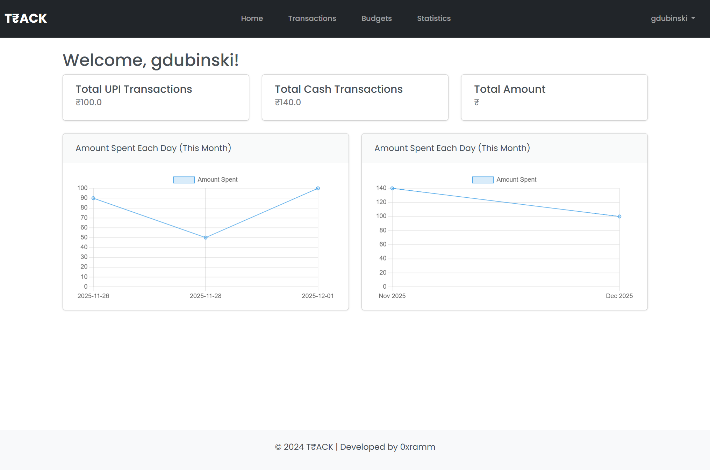
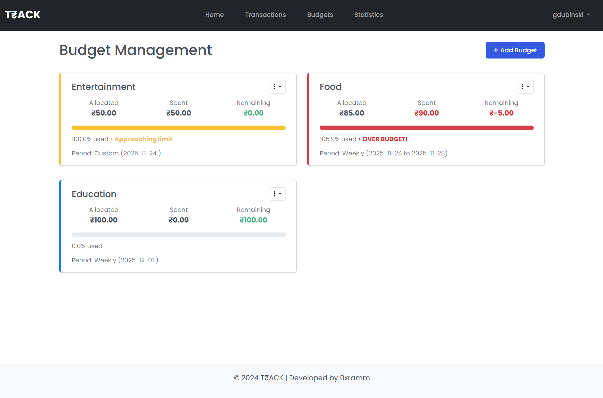
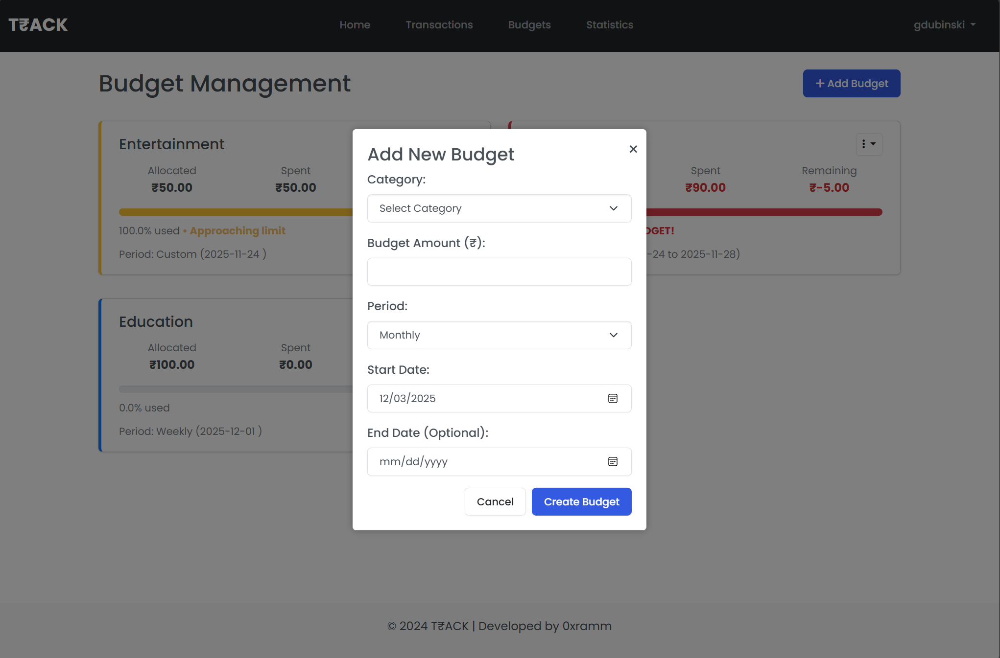

# Finance Tracker Flask App

This Flask-based web application serves as a comprehensive finance tracker, enabling users to manage their expenses and income securely. It provides features for user registration, authentication, transaction management, and analytical insights into spending habits.

## Features

- **User Authentication**: Secure registration and login functionality.
- **Transaction Management**: Add, delete, and view expense and income transactions.
- **Analytics**: Insights into spending patterns by payment method and category.
- **Responsive Interface**: User-friendly design for easy navigation and interaction.

## Live Preview

<a href="https://0xramm.pythonanywhere.com/" target="_blank">Finance-Tracker-Live-Preview</a>


## Screenshots

<!-- Add screenshots of your application here -->
#### Login Page

#### Registration Page

#### Dashboard

#### Transaction_page

#### Add Transaction Popup

#### Budgets_page

#### Add Budget Popup

#### Statistics page


## Installation

1. Clone the repository:

   ```bash
   git clone https://github.com/0xramm/Finance-Tracker.git
   ```

2. Navigate to the project directory:

   ```bash
   cd Finance-Tracker
   ```

3. Install dependencies:

   ```bash
   pip install -r requirements.txt
   ```

## How to Run

### Prerequisites
- Python 3.8 or higher
- pip (Python package installer)

### Quick Start

1. **Clone the repository:**
   ```bash
   git clone https://github.com/0xramm/Finance-Tracker.git
   cd Finance-Tracker
   ```

2. **Install dependencies:**
   ```bash
   pip install -r requirements.txt
   ```

3. **Run the application:**
   
   **Option A: Refactored Version (Recommended)**
   ```bash
   python run_refactored.py
   ```
   
   **Option B: Original Version**
   ```bash
   python app.py
   ```

4. **Access the application:**
   Open your web browser and go to: `http://localhost:5000`

### First Time Setup
1. Register a new account or use the existing demo data
2. Start adding your income and expense transactions
3. Create budgets to track your spending
4. View analytics and statistics on your financial habits

### Features Available
- **User Authentication**: Secure login and registration
- **Transaction Management**: Add income and expense transactions
- **Budget Tracking**: Set and monitor spending limits
- **Analytics Dashboard**: Visual insights and spending patterns
- **Responsive Design**: Works on desktop and mobile devices

## Contributing

Contributions are welcome! If you'd like to contribute to this project, please follow these steps:

1. Fork the repository.
2. Create a new branch (`git checkout -b feature/your_feature_name`).
3. Make your changes.
4. Commit your changes (`git commit -am 'Add some feature'`).
5. Push to the branch (`git push origin feature/your_feature_name`).
6. Create a new pull request.

## License

This project is licensed under the [MIT License](LICENSE).

## Acknowledgements

- [Flask](https://flask.palletsprojects.com/): Web framework for Python.
- [SQLite](https://www.sqlite.org/): Lightweight, serverless database engine.
- [Chart.js](https://www.chartjs.org/): JavaScript library for data visualization.
